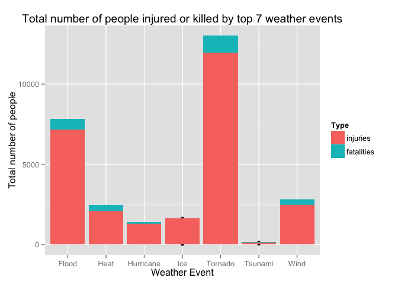

# StormData
J  
October 20, 2014  
# Dangerous Weather
## Synopsis
This project aims to determine what types of severe weather have the greatest impact on the health and property of individuals in the United States. To achieve this, the U.S. National Oceanic and Atmospheric Administration's (NOAA) storm database is used. This database records the injuries, fatalities, property damage, crop damage, and other information for a variety of severe weather events dating back to 1950. After analyzing the data it is found that tornados and tsunamis are most harmful with respect to population health. Flooding events are found to have the greatest econimic consequences.

##Data Processing
The data was loaded from the U.S. National Oceanic and Atmospheric Administration's (NOAA) storm database on October 19, 2014. For this study, only the following observation types were used:
1. State
2. Event Type
3. Injuries
4. Fatalities
5. Property Damage
6. Crop Damage


```r
#download.file("https://d396qusza40orc.cloudfront.net/repdata%2Fdata%2FStormData.csv.bz2", destfile="StormData.csv.bz2",method="curl")

StormData<-read.csv("./StormData.csv.bz2", header=T, na.strings = "NA",colClasses=c(rep("NULL",6),"character","character",rep("NULL",14),"numeric","numeric","numeric","character","numeric","character",rep("NULL",9)))

#Fill in NA values
StormData[StormData==""]=NA
StormData[StormData=="?"]=NA

#Only use the complete cases with no missing values
temp1<-complete.cases(StormData)
StormData<-StormData[temp1,]
rm(temp1)
```

Many weather events list multiple causes or have different names for the same event. In order to simplify the list, weather events were grouped based on the most severe weather type listed in the event. For example, if the original event was named "HURRICANE WIND HAIL", it was changed to event type "Hurricane". In this way, the list of 125 different weather event types was reduced to 22.

```r
StormData$myevent<-StormData$EVTYPE
  
StormData$myevent[grep("HURRICANE|TYPHOON|TROPICAL|SPOUT|SURGE",StormData$EVTYPE)]<-"Hurricane"
StormData$myevent[grep("BLIZZARD|WINTER|SLEET|SNOW",StormData$EVTYPE)]<-"Winter Storm"
StormData$myevent[grep("AVALANCHE",StormData$EVTYPE)]<-"Avalanche"
StormData$myevent[grep("TORNADO|FUNNEL|GUSTNADO",StormData$EVTYPE)]<-"Tornado"
StormData$myevent[grep("TSUNAMI|SEICHE",StormData$EVTYPE)]<-"Tsunami"
StormData$myevent[grep("FLOOD|FLD|Flooding",StormData$EVTYPE)]<-"Flood"
StormData$myevent[grep("VOLCANIC",StormData$EVTYPE)]<-"Volcano"
StormData$myevent[grep("HAIL",StormData$EVTYPE)]<-"Hail"
StormData$myevent[grep("THUNDERSTORM|LIGHTNING",StormData$EVTYPE)]<-"Thunderstorm"
StormData$myevent[grep("FIRE|SMOKE",StormData$EVTYPE)]<-"Fire"
StormData$myevent[grep("DUST",StormData$EVTYPE)]<-"Dust Storm"
StormData$myevent[grep("RIP",StormData$EVTYPE)]<-"Rip current"
StormData$myevent[grep("LANDSLIDE",StormData$EVTYPE)]<-"Landslide"
StormData$myevent[grep("WIND|MICROBURST",StormData$EVTYPE)]<-"Wind"
StormData$myevent[grep("SURF|Surf",StormData$EVTYPE)]<-"High Surf"
StormData$myevent[grep("RAIN",StormData$EVTYPE)]<-"Rain"
StormData$myevent[grep("DROUGHT",StormData$EVTYPE)]<-"Drought"
StormData$myevent[grep("ICE|ICY",StormData$EVTYPE)]<-"Ice"
StormData$myevent[grep("TIDE",StormData$EVTYPE)]<-"Tide"
StormData$myevent[grep("FOG",StormData$EVTYPE)]<-"Fog"
StormData$myevent[grep("HEAT",StormData$EVTYPE)]<-"Heat"
StormData$myevent[grep("FREEZE|COLD|Frost",StormData$EVTYPE)]<-"Cold"
```
The data is then split based on weather event types so it can be analyzed accordingly.

```r
#change the event types into factor variables
StormData$myevent<-as.factor(StormData$myevent)
#split the data set based on the event types
temp<-split(StormData,StormData$myevent)
```
##Data Analysis
###Public Health
To determine a weather event's impact on public health, the data for injuries and fatalities is examined. Looking at both the sum and the mean of injuries or fatalities is important. 


```r
booboos_sum<-sapply(temp,function(x) colSums(x[c("INJURIES")]))
booboos_mean<-sapply(temp,function(x) colMeans(x[c("INJURIES")]))
death_sum<-sapply(temp,function(x) colSums(x[c("FATALITIES")]))
death_mean<-sapply(temp,function(x) colMeans(x[c("FATALITIES")]))
```


The sum will convey the total number of people injured or killed by a particular weather event. Even if a weather event only kills a few people each time it ocurrs, it can still be the top killer if the event ocurrs frequently.

```r
injSname<-names(booboos_sum[which.max(booboos_sum)])
injSname<-gsub(".INJURIES","",injSname)
injSnum<-max(booboos_sum)
fatSname<-names(death_sum[which.max(death_sum)])
fatSname<-gsub(".FATALITIES","",fatSname)
fatSnum<-max(death_sum)
```
In this dataset, the weather event with the largest total number of injuries is Tornado with 1.196 &times; 10<sup>4</sup> injuries. 
The weather event with the largest total number of fatalities is Tornado with 1064 fatalities recorded.


The mean will convey the average number of people injured or killed by a particular weather event. A weather event that injures or kills a large number of people each time it ocurrs is considered extremely dangerous, regardless of frequency.

```r
injMname<-names(booboos_mean[which.max(booboos_mean)])
injMname<-gsub(".INJURIES","",injMname)
injMnum<-max(booboos_mean)
fatMname<-names(death_mean[which.max(death_mean)])
fatMname<-gsub(".FATALITIES","",fatMname)
fatMnum<-max(death_mean)
```
In this dataset, the weather event with the largest average number of injuries is Tsunami with 4.9615 injuries. 
The weather event with the largest average number of fatalities is Tsunami with 1.2692 fatalities recorded.

###Economic Impact
To determine a weather event's economic impact, the data for crop and property damage was assesed. 

```r
StormData$property<-StormData$PROPDMGEXP
StormData$crop<-StormData$CROPDMGEXP
#take into account the modifier
StormData$property[grep("B|b",StormData$PROPDMGEXP)]<-c(1000000000)
StormData$property[grep("M|m",StormData$PROPDMGEXP)]<-c(1000000)
StormData$property[grep("K|k",StormData$PROPDMGEXP)]<-c(1000)
#multiply by the sig figs
StormData$property<-as.numeric(StormData$property) * StormData$PROPDMG
#Now do crop damage
#take into account the modifier
StormData$crop[grep("B|b",StormData$CROPDMGEXP)]<-c(1000000000)
StormData$crop[grep("M|m",StormData$CROPDMGEXP)]<-c(1000000)
StormData$crop[grep("K|k",StormData$CROPDMGEXP)]<-c(1000)
#multiply by the sig figs
StormData$crop<-as.numeric(StormData$crop) * StormData$CROPDMG
```
The sum of property and crop damage for each weather event type was calculated.

```r
temp<-split(StormData,StormData$myevent)
#Sum the total damages due to different weather types
CropDamage<-sapply(temp,function(x) colSums(x[c("crop")]))
PropertyDamage<-sapply(temp,function(x) colSums(x[c("property")]))
```
 

##Results
###Public Health
The two most dangerous weather events to public health in the United States are tornados and tsunamis. In this analysis the category tsunami consists of both traditional tsunamis and seiches (a standing wave in an enclosed or partially enclosed body of water such as a lake). The tornado category includes tornadoes, funnel clouds, and gustnados. 


```r
#############################
#reformat for plotting sum data
#make a data frame for injuries and fatalities. 
dfIN<-data.frame(booboos_sum,rep("injuries",22))
dfFT<-data.frame(death_sum,rep("fatalities",22))
row.names(dfIN)<-gsub(".INJURIES","",row.names(dfIN))
row.names(dfFT)<-gsub(".FATALITIES","",row.names(dfFT))
dfIN<-cbind(dfIN,row.names(dfIN))
dfFT<-cbind(dfFT,row.names(dfFT))
#label the columns
names(dfIN)<-c("Total","Type","Event")
names(dfFT)<-c("Total","Type","Event")

#combine the two data frames
GrandTotal<-rbind(dfIN,dfFT)

#take out the top 7 weather events
top7_sum<-GrandTotal[c("Heat","Heat1","Flood","Flood1","Wind","Wind1","Hurricane","Hurricane1","Tornado","Tornado1","Ice","Ice1","Tsunami","Tsunami1"),]

#plot it
library(ggplot2)
qplot(Event,Total,data=top7_sum,fill=Type,xlab="Weather Event",ylab="Total number of people",main="Total number of people injured or killed by top 7 weather events")+geom_histogram(stat = "identity")
```

 

```r
#################################
#reformat for plotting mean data
#make a data frame for injuries and fatalities. 
dfINJ<-data.frame(booboos_mean,rep("injuries",22))
dfFAT<-data.frame(death_mean,rep("fatalities",22))
row.names(dfINJ)<-gsub(".INJURIES","",row.names(dfINJ))
row.names(dfFAT)<-gsub(".FATALITIES","",row.names(dfFAT))
dfINJ<-cbind(dfINJ,row.names(dfINJ))
dfFAT<-cbind(dfFAT,row.names(dfFAT))
#label the columns
names(dfINJ)<-c("Total","Type","Event")
names(dfFAT)<-c("Total","Type","Event")

#combine the two data frames
MeanTotal<-rbind(dfINJ,dfFAT)

#take out the top 7 weather events
top7_mean<-MeanTotal[c("Heat","Heat1","Flood","Flood1","Wind","Wind1","Hurricane","Hurricane1","Tornado","Tornado1","Ice","Ice1","Tsunami","Tsunami1"),]

#plot it
library(ggplot2)
qplot(Event,Total,data=top7_mean,fill=Type,xlab="Weather Event",ylab="Mean number of people",main="Mean number of people injured or killed by top 7 weather events")+geom_histogram(stat = "identity")
```

 


As show in the above graphs, tsunamis injure and kill the most people per occurance and are therefore extremely dangerous. Tornados injure and kill fewer people per occurance, but are much more frequent, making them the largest cause of injury and death due to weather in the Unites States.

As a government official attempting to prepare your state for hazardous weather, it would be prudent to first examine the frequency of tornados and/or tsunamis ocurring in your state. If, for example, your state is landlocked with no risk of tsunamis, then tornadoes will be your biggest threat.

Please check the following tables to determine the frequency of tornados and tsunamis in your state.

```r
#How many tornado and tsunami events per state
StormData$STATE<-as.factor(StormData$STATE)
temp2<-split(StormData,StormData$STATE)
tornado<-sapply(temp2, function(x) sum(x == "Tornado"))
tsunami<-sapply(temp2, function(x) sum(x == "Tsunami"))
#List it in a table
as.table(tornado)
```

```
##  AK  AL  AM  AN  AR  AS  AZ  CA  CO  CT  DC  DE  FL  GA  GM  GU  HI  IA 
##   5 889   0   0 422   1  60  93 274  20   0  13 387 375   0   0  11 618 
##  ID  IL  IN  KS  KY  LA  LC  LE  LH  LM  LO  LS  MA  MD  ME  MI  MN  MO 
##  27 324 243 843 313 366   0   0   0   0   0   0  14  70  29 127 435 536 
##  MS  MT  NC  ND  NE  NH  NJ  NM  NV  NY  OH  OK  OR  PA  PH  PK  PR  PZ 
## 445  91 263 445 442  17  22  58   8  98 157 464  30 130   0   0   5   0 
##  RI  SC  SD  TN  TX  UT  VA  VI  VT  WA  WI  WV  WY  XX 
##   1 194 217 466 954  25 178   1  10  37 405  21  92   0
```

```r
as.table(tsunami)
```

```
## AK AL AM AN AR AS AZ CA CO CT DC DE FL GA GM GU HI IA ID IL IN KS KY LA LC 
##  0  0  0  0  0  4  0 12  0  0  0  0  1  0  0  0  1  0  0  0  0  0  0  0  0 
## LE LH LM LO LS MA MD ME MI MN MO MS MT NC ND NE NH NJ NM NV NY OH OK OR PA 
##  0  0  0  0  0  0  0  0  1  0  0  0  0  0  0  0  0  0  0  0  4  0  0  2  0 
## PH PK PR PZ RI SC SD TN TX UT VA VI VT WA WI WV WY XX 
##  0  0  0  0  0  0  0  0  0  0  0  0  0  0  1  0  0  0
```

###Econimic Impact
To determine the weather event with the greatest economic impact, the total dollar amounts for crop and property damage were calculated for each weather event type. The figure below shows the total damages for the top 5 weather events. 

```r
#reformat for plotting
#make a data frame for crop and property damage. 
dfCD<-data.frame(CropDamage,rep("crop",22))
dfPD<-data.frame(PropertyDamage,rep("property",22))
row.names(dfCD)<-gsub(".crop","",row.names(dfCD))
row.names(dfPD)<-gsub(".property","",row.names(dfPD))
dfCD<-cbind(dfCD,row.names(dfCD))
dfPD<-cbind(dfPD,row.names(dfPD))
#label the columns
names(dfCD)<-c("Damages","Type","Event")
names(dfPD)<-c("Damages","Type","Event")

#combine the two data frames
total<-rbind(dfCD,dfPD)

#take out the top 5 weather events
top5<-total[c("Hail","Hail1","Flood","Flood1","Wind","Wind1","Hurricane","Hurricane1","Tornado","Tornado1"),]

#plot it
library(ggplot2)
qplot(Event,Damages,data=top5,fill=Type,xlab="Weather Event",ylab="Damages ($)",main="Total damages caused by top 5 weather events")+geom_histogram(stat = "identity")
```

 


As show in the graph above, flooding events caused by far the most monetary damage and therefore had the greatest economic consequences.
